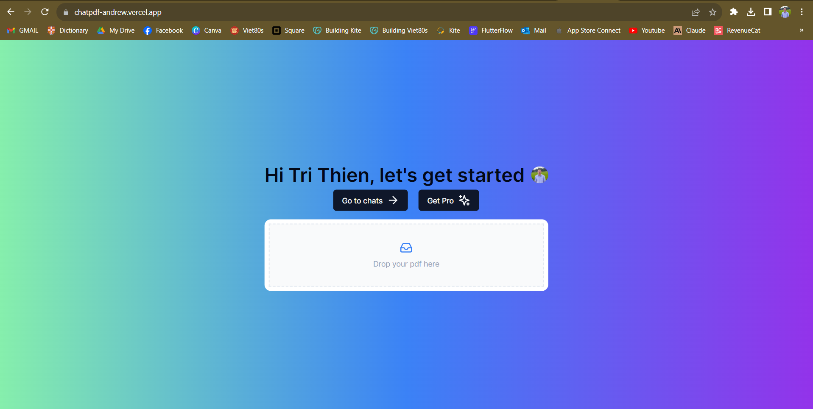

# ChatPDF

ChatPDF is a web app that can understand and answer questions about an uploaded PDF document. It serves as an assistant to help researchers, students, or professionals quickly find precise information from PDFs.





## Installation <a name="installation"/>

This is a [Next.js](https://nextjs.org/) project bootstrapped with [`create-next-app`](https://github.com/vercel/next.js/tree/canary/packages/create-next-app).

First, run the development server:

```bash
npm run dev
# or
yarn dev
# or
pnpm dev
# or
bun dev
```

Open [http://localhost:3000](http://localhost:3000) with your browser to see the result.

## Key Features
- Upload a PDF and ask questions about its content
- Powered by AI to read and understand PDF documents
- Provides accurate answers to questions in plain language
- Built using Next.js, React, TypeScript, and other modern technologies
- Hosted on Vercel for fast, global access with minimal latency
- Leverages AWS S3, LangChain, Pinecone, and ChatGPT to understand documents and generate answers
- Improved UI/UX compared to original, plus user account management
- Share customized dashboard links to manage conversations

## Demo
A live demo is available here:

https://chatpdf-andrew.vercel.app/

Try it out by uploading a PDF or using one of the samples!

## Hosting
ChatPDF is currently hosted on Vercel and leverages its serverless platform for scale, speed, and ease of use. The front-end application is hosted on Vercel Edge locations around the world to minimize latency. PDF documents are stored in AWS S3 buckets in relevant regions.

The UI is a progressive web app that caches content like App Shell architecture. Pages render extremely quickly even for complex pages due to granular caching and static optimization.

## Table of Contents
### 1. [Installation](#installation)
### 2. [Usage](#usage)
### 3. [Contributing](#contributing)
### 4. [Credits](#credits)


## Usage <a name="usage"/>

### Uploading PDFs:

Click the upload button and select a PDF file from your computer. Wait for it to process (depending on size this takes 5-15 seconds).

### Asking Questions:

Type questions related to the content of the PDF in plain English into the text prompt area - e.g. "What is the main topic of this research paper?". The AI will scan the uploaded document and attempt to return an accurate answer by analyzing the content.

### Managing Conversations:

Logged in users can access a personalized dashboard to manage conversations, PDFs uploaded, and questions asked. Share the dashboard link to keep discussions ongoing.

## Contributing <a name="contributing"/>

Pull requests are welcome. For major changes, please open an issue first to discuss what you would like to change.

## Credits <a name="credits"/>

ChatPDF was inspired by Elliott Chong's YouTube Tutorial. It builds on his open-sourced project with UI and architectural improvements.

Huge thanks to:

- [Elliot Chong](https://github.com/Elliott-Chong/chatpdf-yt)
- Anthropic
- LangChain
- Pinecone
- OpenAI

[Tri Thien Nguyen](https://www.linkedin.com/in/tri-thien-nguyen/)
